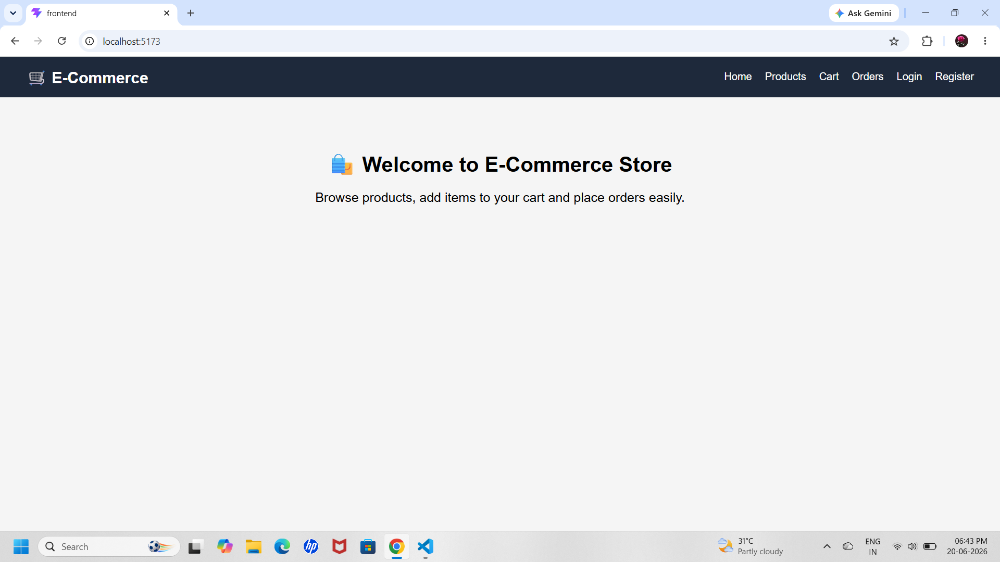
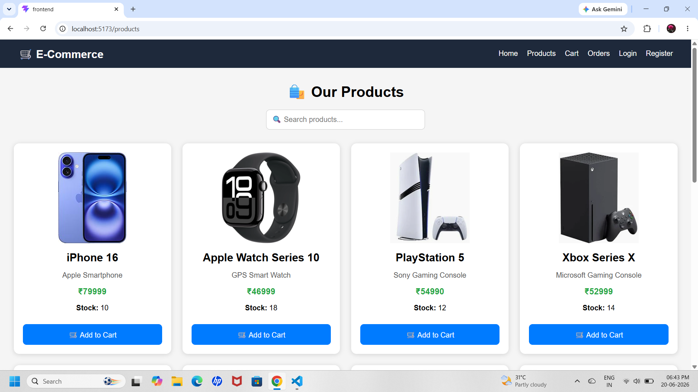
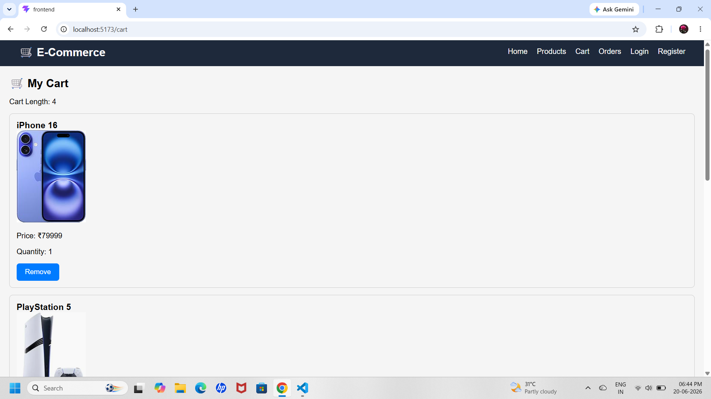
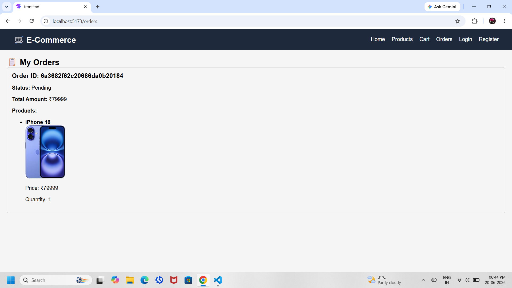
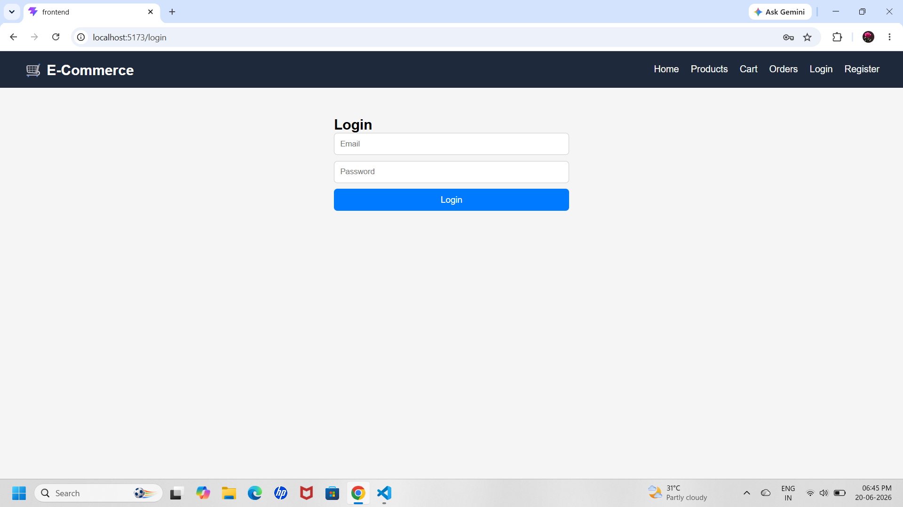
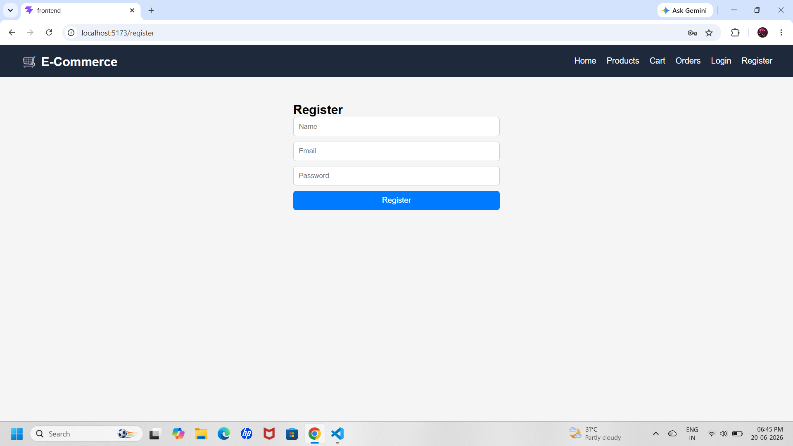

# 🛒 E-Commerce Web Application (MERN Stack)

A full-stack E-Commerce web application built using **MongoDB, Express, React, and Node.js (MERN Stack)**.  
This project includes product listing, search, cart functionality, and user authentication.

---

## 🚀 Features

- 🔐 User Registration & Login (JWT Authentication)  
- 🛍️ Product Listing Page  
- 🔍 Product Search Functionality  
- 🖼️ Product Images Support  
- 🛒 Add to Cart / Remove from Cart  
- 📦 Product Stock Management  
- 📱 Fully Responsive UI  

---

## 🧑‍💻 Tech Stack

**Frontend**
- React.js  
- Axios  
- CSS / Tailwind (optional)

**Backend**
- Node.js  
- Express.js  
- MongoDB  
- Mongoose  
- JWT Authentication  

---

## 📁 Project Structure

```
ecommerce-project/
│
├── frontend/
│   ├── public/
│   │   └── images/
│   ├── src/
│   └── package.json
│
├── backend/
│   ├── models/
│   ├── routes/
│   ├── controllers/
│   ├── middleware/
│   └── server.js
│
├── README.md
```

## ⚙️ Installation & Setup

### 1️⃣ Clone the repository

```bash
git clone https://github.com/anandhavalli11/-E-Commerce
cd ecommerce-project
```

---

### 2️⃣ Backend Setup

```bash
cd backend
npm install
npm start
```

Create `.env` file inside backend folder:

```env
MONGO_URI=your_mongodb_connection_string
JWT_SECRET=your_secret_key
PORT=5000
```

---

### 3️⃣ Frontend Setup

```bash
cd frontend
npm install
npm start
```

---

## 🔗 API Endpoints

### 🔐 Authentication

- POST `/api/auth/register`
- POST `/api/auth/login`

---

### 🛍️ Products

- GET `/api/products`
- POST `/api/products`
- DELETE `/api/products/:id`

---

### 🛒 Cart

- GET `/api/cart`
- POST `/api/cart`
- DELETE `/api/cart/:id`

---

## 📸 Screenshots

```
### 🏠 Home Page


### 🛍️ Products Page


### 🛒 Cart Page


### 📦 Orders Page


### 🔐 Login Page


### 📝 Register Page

```

---

## ✨ Future Improvements

- ⭐ Product Rating System  
- 🏷️ Category Filtering  
- ❤️ Wishlist Feature  
- 💳 Payment Gateway Integration  
- 📊 Admin Dashboard  
- 🔔 Order Tracking System  

---

## 👨‍💻 Author

- Name: Anandha Valli V

---

## 🎯 How to Use

- Clone repo  
- Install dependencies (frontend + backend)  
- Add `.env` file  
- Run backend → `npm start`  
- Run frontend → `npm start`  
- Open http://localhost:3000  

---

## 🔥 Done!

If you like this project, give a ⭐ on GitHub!
